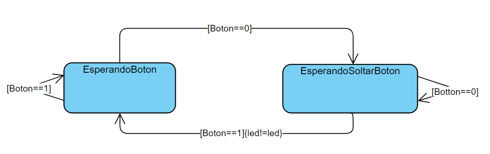

# Ejemplo de maquina de estados

La máquina tiene dos estados.

NoPulsado
Pulsado
Cuando se pulse el botón se pasará al estado pulsado.
Cuando se suelte el botón pasara al estado nopulsado y cambiará en valor del led.